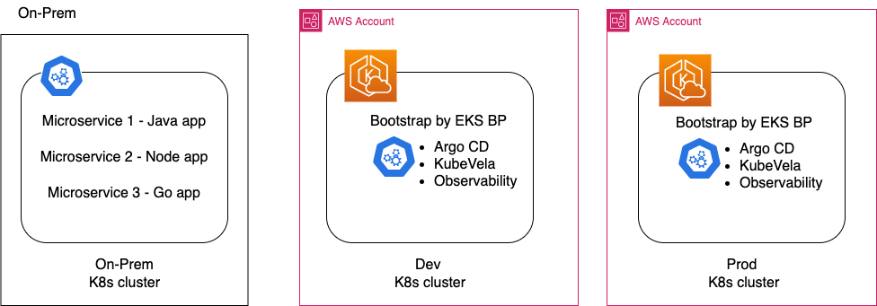
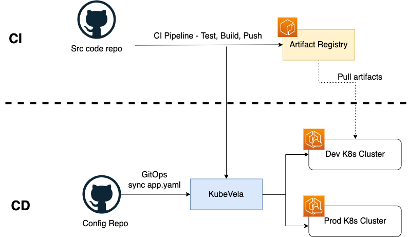
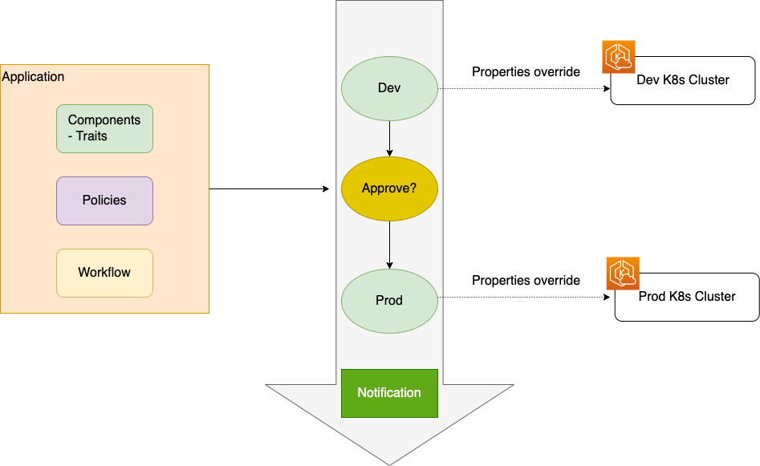

## Env Setup

## GitOps Pipeline

## GitOps Pipeline

## Workshop Structure

1. Setup existing environment
1.1 Setup existing On-Prem env - **does it have to be on K8s if we are going to containerize the apps???**
1.2 Setup Dev and Prod K8s clusters on EKS using EKS BP, this includes the addons like Observability, ArgoCD, KubeVela
2. **Containerization???**
2.1 Containerize Node and Go apps
2.2 Containerize Java app using App2Container
3. Setup CI process
3.1 Build and push Node image to ECR
3.2 Build and push Go image to ECR
3.3 Build and push Java image to ECR
4. Setup CD process
4.1 Configure KubeVela for each app - traits, policies, workflow
4.2 Deploy the apps with vela up
5. Configure KubeVela workflow to demonstrate deployment orchestration
6. Configure KubeVela UX and enable Observability (Grafana, Prometheus)
